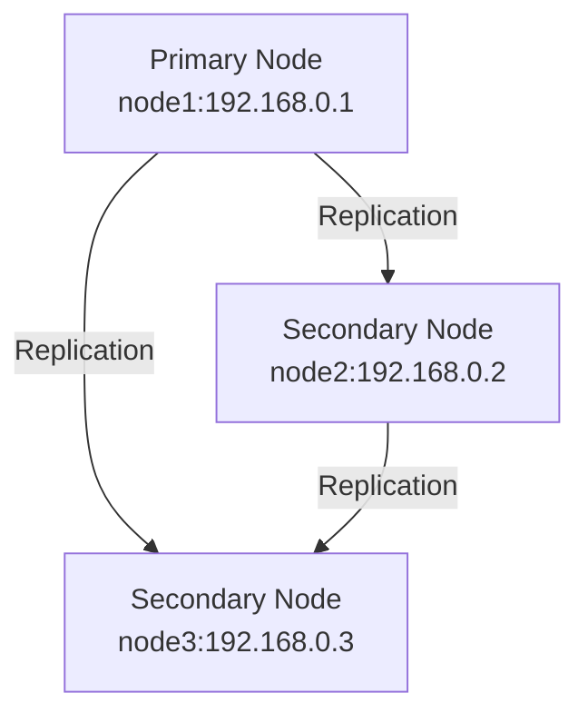

# MySQL InnoDB Cluster Deployment with Ansible


Automated deployment of a highly available MySQL InnoDB Cluster across three nodes using Ansible.

## 📌 Table of Contents

- [Features](#-features)
- [Architecture](#-architecture)
- [Prerequisites](#-prerequisites)
- [Quick Start](#-quick-start)
- [Detailed Usage](#-detailed-usage)
- [Customization](#-customization)
- [Verification](#-verification)
- [Troubleshooting](#-troubleshooting)
- [Contributing](#-contributing)
- [License](#-license)

## ✨ Features

- **Automated Cluster Setup**: Fully automated deployment of 3-node MySQL cluster
- **High Availability**: Automatic failover and recovery
- **Secure Configuration**: Built-in security hardening
- **Idempotent Operations**: Safe to run multiple times
- **Customizable**: Easily adjust configuration parameters

## 🏗 Architecture


## 🛠 Prerequisites
Control Machine
Ansible 2.9+

Python 3.6+

MySQL Shell 8.0+

## Target Nodes (x3)
Ubuntu 18.04/20.04 LTS

Minimum 2GB RAM

10GB free disk space

SSH access with sudo privileges

## Network
Static IPs configured

Open ports between nodes:

3306 (MySQL)

33061 (Group Replication)

22 (SSH)

## 🚀 Quick Start

1. Clone the repository:
```bash
git clone https://github.com/yourusername/mysql-cluster-ansible.git
cd mysql-cluster-ansible
```
2. Edit the inventory file with your node IPs:
```bash
nano inventory.ini
```
3. Set your MySQL credentials:
```bash
nano vars/mysql.yml
```
4.Deploy the cluster:
```bash
ansible-playbook -i inventory.ini playbook.yml
```
## 📖 Detailed Usage
Inventory Configuration
Modify `inventory.ini` with your node details:
```bash
[mysql_servers]
node1 ansible_host=192.168.0.1
node2 ansible_host=192.168.0.2
node3 ansible_host=192.168.0.3

[mysql_servers:vars]
ansible_user=ubuntu
ansible_ssh_private_key_file=~/.ssh/your_key.pem
```
## Variable Customization
Key variables in `vars/mysql.yml`:
```bash
mysql_root_password: "secure_password_here"  # Change this!
mysql_cluster_name: "production_cluster"
mysql_version: "8.0"
```
Playbook Execution Options


